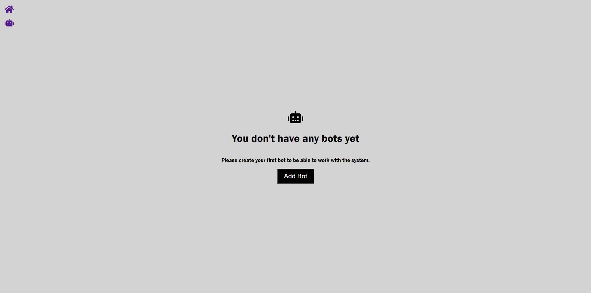
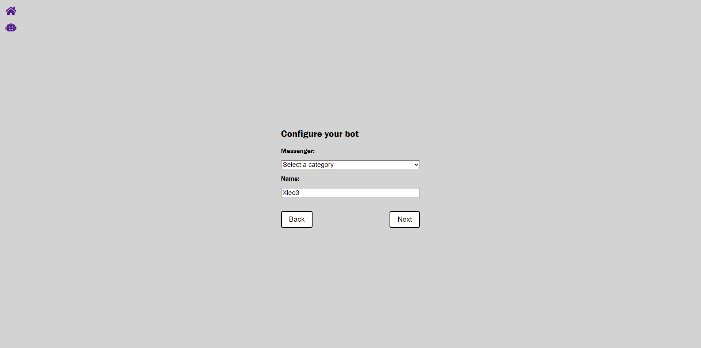
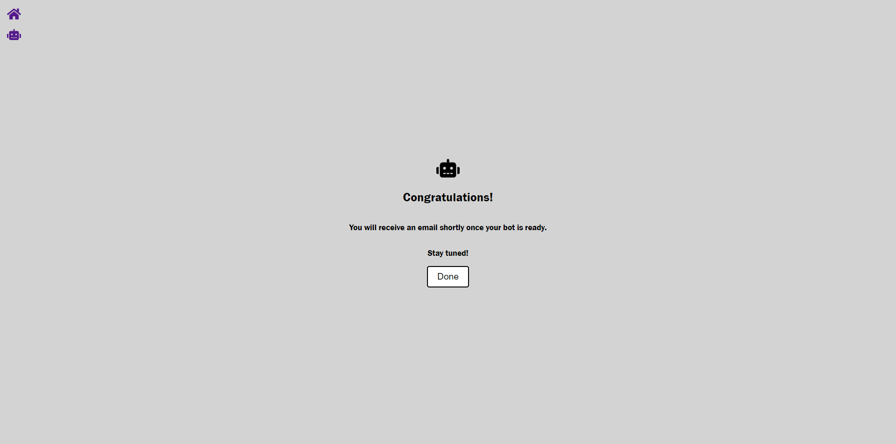

# Bot Creator

The following project is a bot-creator prototype. 
This system will allow users to create their own bots based on a set of predetermined parameters.

## Link Access
Access to the Bot-creator site through the [following link](http://Ggariv.github.io/bot-test)

## User Story

```
As A Business Wwner 
I WANT to be able to create a bot and configure bots automated replies for the following categories: Refund, Product Details, Customer Support
SO THEN I can choose action per each category I configure, and the actions should be: Message, Message and action, Message and prompt user for a reply
WITH THE CONDITION of being able to configure a single action per each category
FINALLY, I want to see a list of bots I’ve created, and edit categories in each bot
```

## Acceptance Criteria

```
GIVEN an online bot creator
WHEN I define a new bot with its predetermined parameters,
THEN I obtain the newly created bot and I am able to add/edit other features.
WHEN I want to manually create some answers and be able to edit them
THEN I am given the capacity of edit my created bots to later display them.
```

## Creation Process & Technology employed

```
Use React for the front end.
Heroku deployment
```

## Project Screenshots

Bot-Creator main site


Bot-Configuration


Bot-Finished


- - -
© 2023 IntelSwift llc. brand. Confidential and Proprietary. All Rights Reserved.
